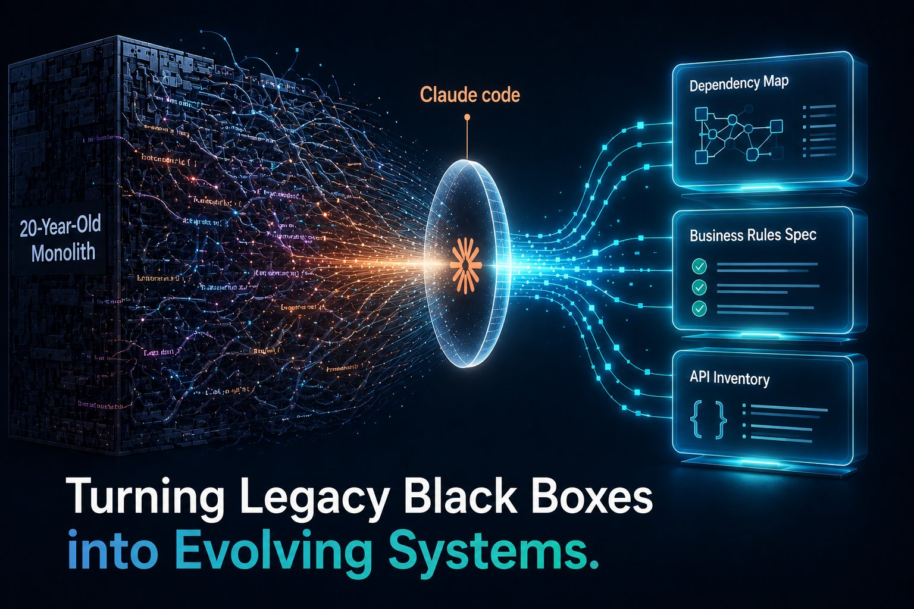
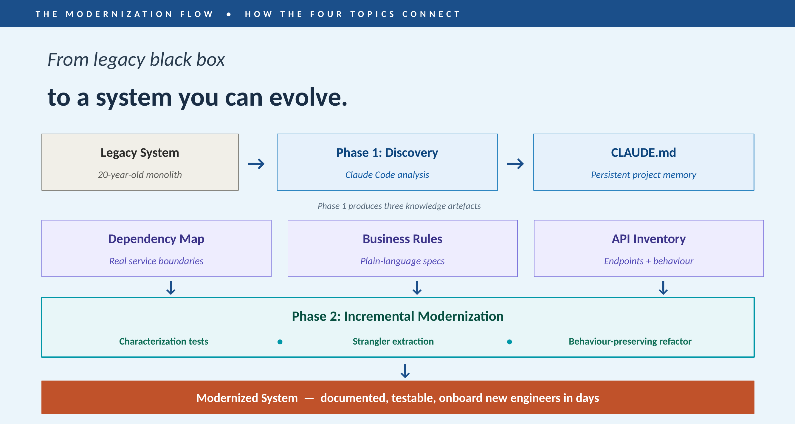
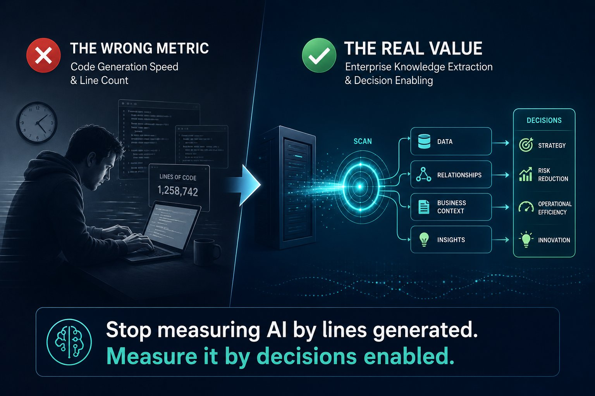

# Claude Code for Modernization of Legacy Applications

**A Practical Perspective**
5 min read

---
In many enterprise companies, the vast majority of revenue is quietly generated by legacy monolithic applications. These systems are often understood by only a handful of developers — many of whom are approaching retirement. When leadership faces this risk, the default playbook is predictable:

1. Hire a System Integrator.
2. Spend 18 months on manual "discovery."
3. Watch the budget triple while hoping something eventually ships.

Unsurprisingly, **74% of these modernization initiatives fail.**

The root cause is never typing speed. It is a failure of understanding.

---

## The reframe most teams miss

Everyone is measuring AI coding tools the wrong way.

- *We count lines of code generated.*
- *We benchmark language conversions.*
- *We celebrate test scaffolding speed.*

And we completely miss the point.

When you stare down a 20-year-old monolith — half a million lines of code, written by developers who've long since retired, documented in tribal knowledge that walks out the door every quarter — Claude Code's superpower isn't writing. **It's reading.**

💬 *SPOTLIGHT QUOTE — highlight this line in the LinkedIn editor:*
> Claude Code reads what your code *does*, not just how it's written. That changes everything.

---

## Four shifts that change the economics

**1. Refactoring monoliths → discovering real boundaries.**

Stop debating monolith vs. microservices on a whiteboard. Claude Code traces call graphs and shared state to surface where the natural seams actually are. Spotify reported up to 90% reduction in engineering time on large-scale migrations using this approach.

**2. API documentation → a CI artefact.**

Your Swagger file lies. Your Confluence page is 7+ years old. Claude Code regenerates endpoint inventories from source — in minutes — and you can wire it into CI so document drift fails the build. Documentation stops being a quarterly project and starts being a side effect of shipping.

**3. Business rules → reviewable specifications.**

This is the one that most teams underestimate. Every legacy codebase has rules buried in *if/else* blocks that exist nowhere else in the organisation. The tax rounding logic. The credit-limit calculation. The eligibility check includes 14 special cases for grandfathered customers.

Ask the business what the rule is, and they'll tell you: *"Whatever the system does today."*

Claude Code extracts those rules into plain-language specs your compliance team can actually review. That artefact alone is worth the price of admission — even if you never rewrite the system.

**4. Onboarding → days, not months.**

New engineer joining a 15-year-old platform? The old answer was six months of shadowing seniors and reading stale wikis. The new answer is a CLAUDE.md file checked into the repo and a query: *"Walk me through what happens when a customer places an order."*

Senior engineers' time stops being burned on "how does X work?" — and that's a retention multiplier most teams don't price in.

---

## How it all connects

These four shifts aren't independent. They form a single, repeatable flow:

*Caption (add as italic text under the image): Phase 1 produces knowledge. Phase 2 produces code. CLAUDE.md outlives both.*

Notice what's *not* in this flow: no six-month consultant-led discovery, no big-bang cutover, no held-breath moment when the switch flips. The whole thing is incremental — and the most valuable artefact (CLAUDE.md) keeps evolving long after the modernisation is done.

Institutional knowledge stops walking out the door when seniors retire. It lives in Git.

---

## Where it doesn't work

A practical perspective has to acknowledge what Claude Code won't do for you:

- **Regulatory interpretation.** It can identify that tax calculations round to the nearest cent. It can't tell you whether that satisfies the statute.
- **Production-level equivalence.** Edge cases that only surface under specific load, timing, or data remain human-led validation work.
- **Architectural judgement.** It's a hyper-competent junior engineer. Use it to execute your plan — not to design it from scratch.
- **Program-level concerns.** Business scoping, organisational change, data migration — these determine success, and they remain firmly human work.

---

*Caption (add as italic text under the image): The shift isn't about coding speed — it's about what AI lets you decide.*

---

## The bottom line

**Stop measuring AI by lines of code generated.** Start measuring it on *decisions enabled*.

The first deliverable of any modernisation programme shouldn't be modern code. It should be an extracted, reviewed specification of what the legacy system actually does.

That's the artefact that has been impossible to produce at scale — until now.

**That's the real practical perspective.** Everything else is a consequence of it.

---

## Appendix — Try this Monday morning

If you're a developer reading this, here are three prompts you can run against your own repo this week. Claude Code is a CLI tool you point at your codebase — no infrastructure setup required.

**1. Map the real dependencies**

> *"Analyze this module. List every public method, its callers across the codebase, the database tables it touches, and any shared mutable state. Flag anything that looks tightly coupled to other modules."*

**2. Extract business rules into a spec**

> *"Extract every business rule embedded in this service into a numbered table. For each rule: a plain-language description, the source file and line range, any special cases or exceptions, and a confidence level. Flag rules that look contradictory."*

**3. Generate characterization tests before refactoring**

> *"Generate characterization tests for this method that lock in current behavior, including edge cases for null inputs, boundary values, and the exception paths. I want to refactor it safely — the tests should fail if I accidentally change the contract."*

**Bonus move:** check a **CLAUDE.md** file into your repo with your stack details, conventions, and the business rules you've extracted. Every Claude Code session starts with that context loaded. **It's the cheapest, highest-leverage thing you can do.**

---

## "Yes, but..." — the honest answer

If you're a senior engineer, you're probably thinking: *"What about hallucinations? Context limits? My codebase is too big. I tried Copilot, and it was useless."*

Fair concerns. Three honest answers:

- **Review every output.** Line numbers can drift, rules can be misread, and edge cases can be missed. Treat Claude Code's output the way you'd treat a smart junior engineer's PR — valuable, but verify before merging.
- **Context is solved by CLAUDE.md.** Large codebases work fine when you give Claude Code persistent project memory. Without it, you're starting from zero every session. With it, you're starting informed.
- **This is not Copilot.** Different tool, different category. Copilot autocompletes lines. Claude Code reasons about systems. If you've only tried inline autocomplete, you haven't seen what agentic AI coding tools can actually do.

The leverage is real. The hygiene matters.

---

## References

- [74% of Organizations Fail to Complete Legacy System Modernization Projects (Business Wire)](https://www.businesswire.com/news/home/20200528005186/en/74-Of-Organizations-Fail-to-Complete-Legacy-System-Modernization-Projects-New-Report-From-Advanced-Reveals)
- [The True Cost of Technical Debt](https://technicaldebtcost.com/)
- [Why enterprise AI ambitions are outpacing legacy modernization (TechRadar Pro)](https://www.techradar.com/pro/why-enterprise-ai-ambitions-are-outpacing-legacy-modernization)

---

*If this resonated, share it forward. And if you're navigating a legacy modernization programme of your own, I'd love to hear from you — drop a comment with your biggest blocker.*
